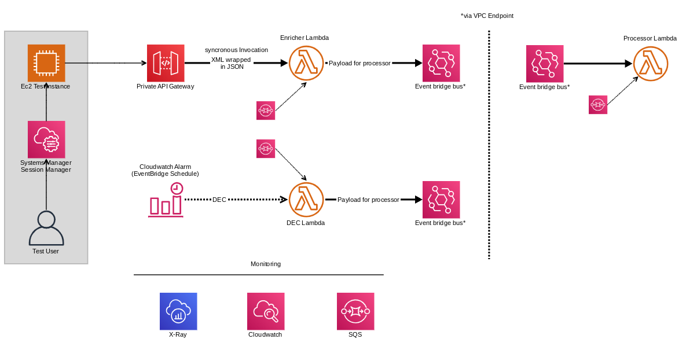
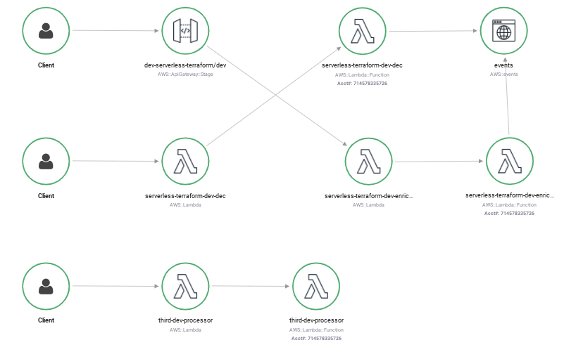

# Adventures in Serverless Framework & Terraform Pt 1.

Exercise in building out a simple architecture in Serverless & Terraform 



* Private API Gateway
* Lambdas
* EventBridge
* * Scheduled 
* * Pattern Based Rule
* X-Ray tracing
* SQS Dead letter Queue
* VPC with Private Subnets only
* VPC endpoints to support API Gateway, EventBridge, SSM
* IAM,Security groups,etc to support the design

## Results
* To pass variables between Terraform and Serverless you can use the Systems Manager Parameter store, by defining your output in a tf variable 
```
resource "aws_ssm_parameter" "subnets2" {
  name        = "/serverless/subnets2"
  description = "Subnet2 for serverless"
  type        = "String"
  value       =  module.vpc.private_subnets[1]
}
```
then using the saved parameter in `serverless.yml` as follows
```
  vpc:
    subnetIds: 
      - ${ssm:/serverless/subnets1}
```
* All of the architecture building blocks and interactions were acheivable using both frameworks with the exception of applying the DLQ to the Lambdas, 
which was'nt possible in version 2.3 [due to a race condition](https://www.serverless.com/framework/docs/providers/aws/guide/functions/). Can probably find another was of doing this or replace with the new [Lambda Desinations](https://aws.amazon.com/blogs/compute/introducing-aws-lambda-destinations/) capability
* X-Ray results where somewhat unexpected as the tracing did not show end to end traces through the eventbridge, could be additional instrumentation required.




## Getting Started

Both Terraform and Serverless need configuring for AWS

* [Serverless](https://www.serverless.com/framework/docs/providers/aws/guide/credentials/)
* [Terraform](https://registry.terraform.io/providers/hashicorp/aws/latest/docs)

Serverless needs the `serverless-python-requirements` plugin installed `npm install --save serverless-python-requirements` for packaging


### Prerequisites

* Terraform .014
* Serverless Framework 2.3
* Python 3.8

### Installing

* [Installing Terraform](https://learn.hashicorp.com/tutorials/terraform/install-cli)
* [Installing Serverless](https://www.serverless.com/framework/docs/getting-started/)


## Deployment

Build out the terraform first

### Terraform
```
terraform init
terraform plan
terraform apply
```

### Serverless
```
serverless deploy
```

## References

* [TF/Serverless guide](https://www.serverless.com/blog/definitive-guide-terraform-serverless)
* [Burning Monk reference](https://theburningmonk.com/2019/03/making-terraform-and-serverless-framework-work-together/)
